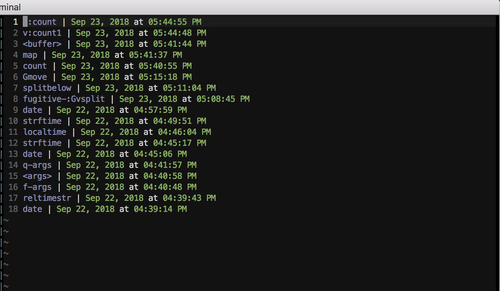

# Vim-Whelp

Keep track of what you've looked up in vim's help. The name, like all my plugins, is just a word that contains the main concept ("help" in this case), but I also think of it as "Write help."

## Overview

You know how some people highlight words they've looked up in the dictionary? I'm not one of those people. But on a whim, I did write this little plugin to keep track of things you've looked up in vim's help. Every time you run `:h something` or `:help something`, vim-whelp records it in a text file. You can then later open that file and browse around and even reopen the help entry.

## Requirements

I'm not exactly sure . . . I'm guessing this works best with vim 7.4 and later, but I haven't feature checked. Some functions use `strftime` which isn't available on all distributions. You can check with `exists('*strftime')`. If you don't have it, this plugin won't break vim . . . it just won't do certain date-related things.

## Installation

If you don't have a preferred installation method, I really like vim-plug and recommend it.

#### Manual

Clone this repository and copy the files in plugin/, autoload/, and doc/ to their respective directories in your vimfiles, or copy the text from the github repository into new files in those directories. Make sure to run `:helptags`.

#### Plug (https://github.com/junegunn/vim-plug)

Add the following to your vimrc, or something sourced therein:

```vim
Plug 'tandrewnichols/vim-whelp'
```

Then install via `:PlugInstall`

#### Vundle (https://github.com/gmarik/Vundle.vim)

Add the following to your vimrc, or something sourced therein:

```vim
Plugin 'tandrewnichols/vim-whelp'
```

Then install via `:BundleInstall`

#### NeoBundle (https://github.com/Shougo/neobundle.vim)

Add the following to your vimrc, or something sourced therein:

```vim
NeoBundle 'tandrewnichols/vim-whelp'
```

Then install via `:BundleInstall`

#### Pathogen (https://github.com/tpope/vim-pathogen)

```sh
git clone https://github.com/tandrewnichols/vim-whelp.git ~/.vim/bundle/vim-whelp
```

## Usage

The short version is "keep using help the way you normally do." This plugin just records all the things you look up (and _when_ you looked them up), and then you can review them at your leisure.

## Commands

### :Whelp

View previous help entries in the current window.

### :VWhelp[!]

View previous help entries in a vertical split. When bang is provided, reverse the normal `splitbelow` settings.

### :SWhelp[!]

View previous help entries in a horizontal split. When bang is provided, reverse the normal `splitright` settings.

### :TWhelp

View previous Help entries in a new tab.

### :ClearWhelp

Remove all previously recorded help entries.

### :DedupeWhelp

Remove all duplicate help terms, keeping only the most recent entry.

### :PruneWhelp {age}

Remove all previously recorded help entries older than {age} (in days).

## Whelp file

By default `vim-whelp` writes help entries to `$HOME/.vim/whelp.txt`, but you can override this location by setting `g:whelp_file`. When you use any of `:Whelp`, `:VWhelp`, `:SWhelp`, or `:TWhelp`, the whelp file will open in the corresponding buffer; it looks something like this:



When whelp is opened in a split, leaving the whelp buffer (e.g. via `<C-w>h`) will autoclose the buffer. When whelp is the active buffer, the following mappings are available:

### K

Reopen the help for this entry.

### [count]-

Delete [count] entries.

## Options

The following options are available to configure the behavior of whelp.

### g:whelp_file

Where to save help entries.

Default: `$HOME/.vim/whelp.txt`

### g:whelp_autoclose

Whether to autoclose the whelp buffer on BufLeave when it's opened in a split.

Default: 1

### g:whelp_remove_entry_mapping

Mapping to remove entries from the whelp file.

Default: -

### g:whelp_reopen_entry_mapping

Mapping to reopen the help for an entry in the whelp file.

Default: K

## Contributing

I always try to be open to suggestions, but I do still have opinions about what this should and should not be so . . . it never hurts to ask before investing a lot of time on a patch.

## License

See [LICENSE](./LICENSE)
